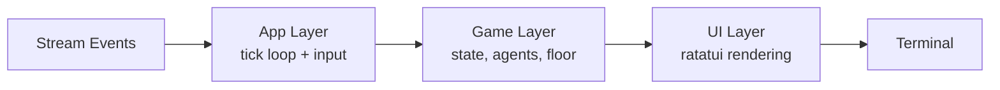

# Agents Story

A pixel-art TUI that turns Claude Code agent sessions into a tiny office simulation. Does nothing useful. Entertaining anyway.


## What is this

Your Claude Code agents read files, write code, run tests. You experience this as scrolling text. This replaces that with pixel people walking to desks and sitting down.

It won't make your agents faster or smarter. It's a screensaver with opinions.

## Features

- **6 staff agents** idle in the lounge until assigned work. They wander near the arcade machines.
- **Temp contractors** appear when demand exceeds headcount. They leave through the top door when done.
- **A CEO** who sprints to the whiteboard and yells when a new task arrives.
- **Desks with animated monitors** showing rainbow pixels. Definitely not Reddit.
- **Arcade machines** that light up when someone walks near them.
- **Collision avoidance.** Standards.
- **FPS and RAM stats.** For monitoring the performance of your monitoring tool.

## Setup

```bash
git clone https://github.com/anduong96/agents-story.git
cd agents-story
cargo build --release
```

Requires [Rust](https://rustup.rs/) 1.70+.

## Usage

Live session mode (connecting to real Claude Code sessions) is not yet implemented — see [Roadmap](#roadmap). For now, use demo mode to see the office in action:

```bash
cargo run -- --demo              # demo mode (2x speed)
cargo run -- --demo --fast       # 5x speed
cargo run -- --demo --extreme    # 10x speed
./dev.sh                         # hot reload with cargo-watch
```

## Controls

| Key | Action |
|-----|--------|
| `q` | Quit |
| `?` | Help |
| `Tab` | Switch floor / agent panel |
| `j` / `k` | Navigate agents |
| `Enter` | Expand agent details |
| Scroll | Scroll workspace |
| Click | Select agent |

## How it works

### Event Pipeline

A discovery module polls the watch directory every 2 seconds for `.jsonl` session files. Each file gets an async reader that streams lines into an mpsc channel. Lines are parsed into `StreamEvent` variants (`AgentSpawn`, `ToolUse`, `AgentResult`, `SessionEnd`) which the game loop consumes to create, update, and retire agents. In demo mode (`--demo`), synthetic events simulate a full session instead.

### Tick Loop

The app runs at **15 FPS** when animating, dropping to **2 FPS** when idle. Each tick:

1. **Move agents** — `advance_along_path()` consumes waypoints at 4.0 tiles/sec (CEO at 6.0). Remaining movement carries into the next waypoint within the same frame.
2. **Collision avoidance** — Snapshot all positions, check 2-cell bounding boxes, apply a perpendicular nudge (2.0 tiles) or revert if blocked.
3. **Lounge wandering** — Idle agents pick from 7 deterministic targets using `(tick_count/90 + sprite_index) % 7`.
4. **Desk cleanup** — When no agents are animating: free unused desks, remap indices, update grid cells.

### Pathfinding

Waypoint-based routing between three rooms (Workspace, Lounge, CEO Office). Adjacent rooms route through the nearest door with waypoints on both sides. Non-adjacent rooms (Lounge ↔ CEO Office) chain through the Workspace center as an intermediate.

### Desk Allocation

Desks are created on demand when an agent needs one and freed when they leave. The grid uses `ceil(sqrt(n))` columns to keep an even layout. Desk variants (Single/Dual/Triple monitors) have different widths (1–2 cells, 3 rows tall). The CEO desk is stored separately from the workspace desk vec.

### Rendering

The floor is drawn in a single pass with textured backgrounds per room using [ratatui](https://github.com/ratatui/ratatui). Desks, furniture, and agents are overlaid on top. Monitor screens use half-block characters (`▀`) with fg = top pixel and bg = bottom pixel for 2x vertical color detail, animating with shifting rainbow colors each frame. Agents are 2×2 sprites with an 8-color palette and directional facing (left/right) based on movement delta.

## Architecture



## Roadmap

- [ ] Homebrew formula (`brew install agents-story`)
- [ ] Connect to live Claude Code sessions
- [ ] Custom office themes (dark mode, neon, corporate beige)
- [ ] Name your agents
- [ ] Choose your floor plan
- [ ] Configurable furniture placement
- [ ] Agent outfit colors via config file
- [ ] Water cooler
- [ ] Meeting room where agents accomplish nothing
- [ ] Bathroom breaks

## Contributing

PRs welcome.

## License

MIT
