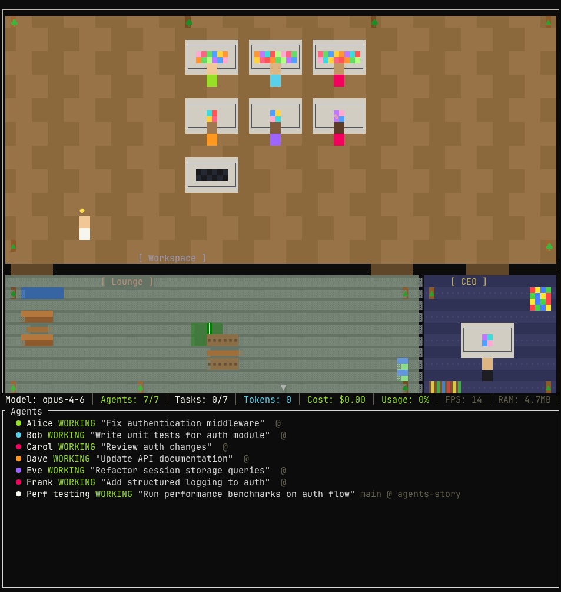

# Agents Story

A Kairosoft-inspired TUI visualization of Claude Code agent sessions. Watch your AI agents work in a pixel-art office with desks, a lounge, and a CEO office.




## Features

- 8-bit pixel-art office with workspace, lounge, and CEO office
- 6 permanent staff agents that idle in the lounge
- Dynamic desk assignment with 1-3 monitor variants
- Animated monitor screens with shifting colors
- Agent collision avoidance
- Scrollable workspace for 10+ agents
- Lounge with TV area, ping pong table, and lunch area
- Real-time FPS and RAM stats

## Prerequisites

- [Rust](https://rustup.rs/) 1.70+

## Setup

```bash
git clone https://github.com/anduong96/agents-story.git
cd agents-story
cargo build --release
```

## Usage

### Demo mode

```bash
cargo run -- --demo
```

### Demo with hot reload

```bash
./demo.sh
```

### Speed options

```bash
cargo run -- --demo          # 2x speed (default)
cargo run -- --demo --fast   # 5x speed
cargo run -- --demo --extreme # 10x speed
```

## Controls

| Key | Action |
|-----|--------|
| `q` | Quit |
| `?` | Toggle help |
| `Tab` | Cycle focus (floor / agent panel) |
| `j` / `Down` | Select next agent |
| `k` / `Up` | Select previous agent |
| `Enter` | Expand/collapse agent details |
| Mouse scroll | Scroll workspace |
| Click | Select agent in panel |

## Project Structure

```
src/
  main.rs        # Entry point, event loop, agent spawn/transition
  app.rs         # App state, tick loop, collision avoidance
  demo.rs        # Demo mode with synthetic agent events
  input.rs       # Keyboard and mouse input handling
  game/
    floor.rs     # Floor grid, rooms, desks, furniture
    agent.rs     # Agent model, status, sprite colors
    state.rs     # Game state, stats
    pathfinding.rs # Waypoint pathfinding between rooms
  ui/
    floor_view.rs  # Main rendering (floor, desks, agents)
    sprites.rs     # Color palette, desk sprites, decorations
    agent_panel.rs # Side panel listing agents
    stats_bar.rs   # Bottom stats bar
    bubbles.rs     # Status indicator system
  stream/
    protocol.rs  # Stream event types
    reader.rs    # Stream message reader
```

## License

MIT
